# IRCTC-train
sample API for IRCTC,

# NODE.JS SERVER FOR USER REGISTRATION AND LOGIN WITH POSTGRES DATABASE

This is a node.js backend server for registering users and 
It also uses the JWT Library to provide users with a token on registering or when logging in. user can ch eck train availibility, book tickets, get details of thier booking id PNR
This is Backend only setup , We are using Postman for interacting with Api

### INSTALLATIONS

To run the server first you need to the following programs installed on your machine

1. **Node.js**
2. **postresql**

If the following programs are missing kindly visit the links below, download and install them.

1. [Node js](https://nodejs.org/en/)
2. [PostgreSQL](https://postgresql.org/download/)

## NODE.JS BACKEND SETUP

You need to install following libraries using npm
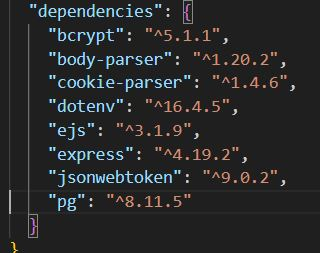
### INSTALLATIONS

### STARTING THE SERVER

If you have the all installations ready, run the following commands in your editor

1. **npm install** to install the packages required by the server
2. **npm run dev** to start your server on the machine

### SETTING UP YOUR DATABASE

Setup the database using PgAdmin
Database details should look like
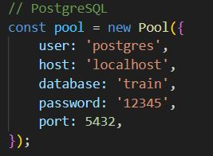

see queries.sql file for refference

After installing all dependancies, you can start sever by
nodemon server.js
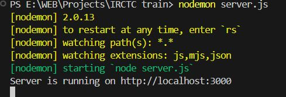

### Running API

### Register
you can register new user by providing username and password , It will show error if user is alredy registered
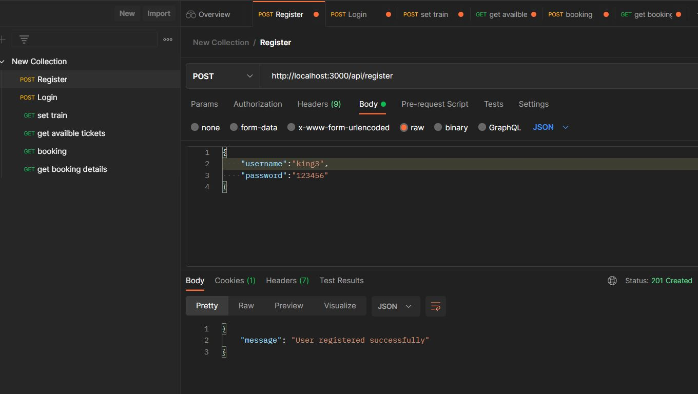

### Login

you can use this api to login user who is already registered by providing username and password , It will show error if user is  not registered. Also this function will create web token further we can use this for booking purpose. 

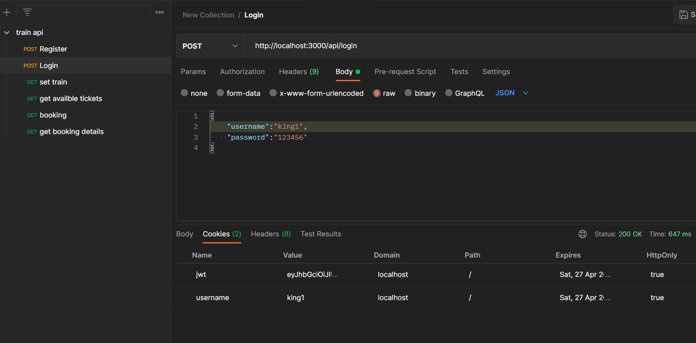

### Add train details

Only admin can use this api.
This Api is used to add new train , with source and destination and total seats

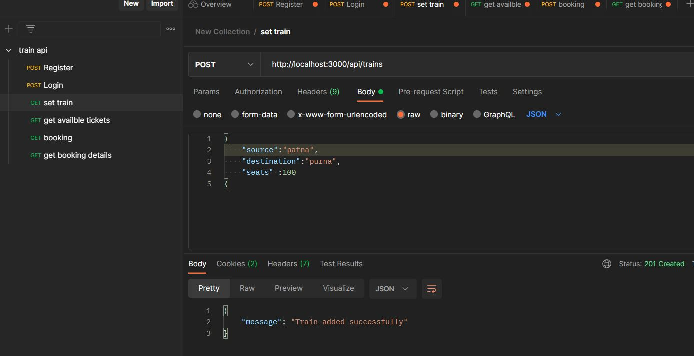

### Check Availability

User can use this Api to find Availability of seats, they need to enter source and destination, to get desired result

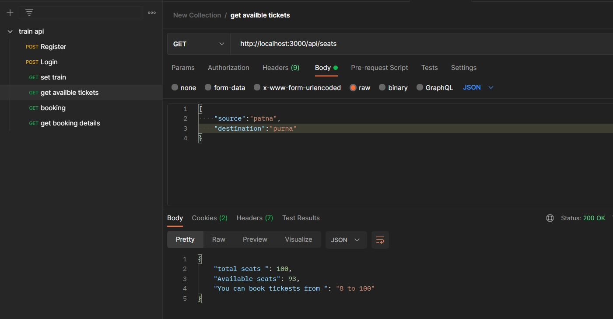

### Booking a seat

User can use this Api to  to book their seats, they need to enter source and destination, In return they will get a Booking Id , they can use it further as a PNR number

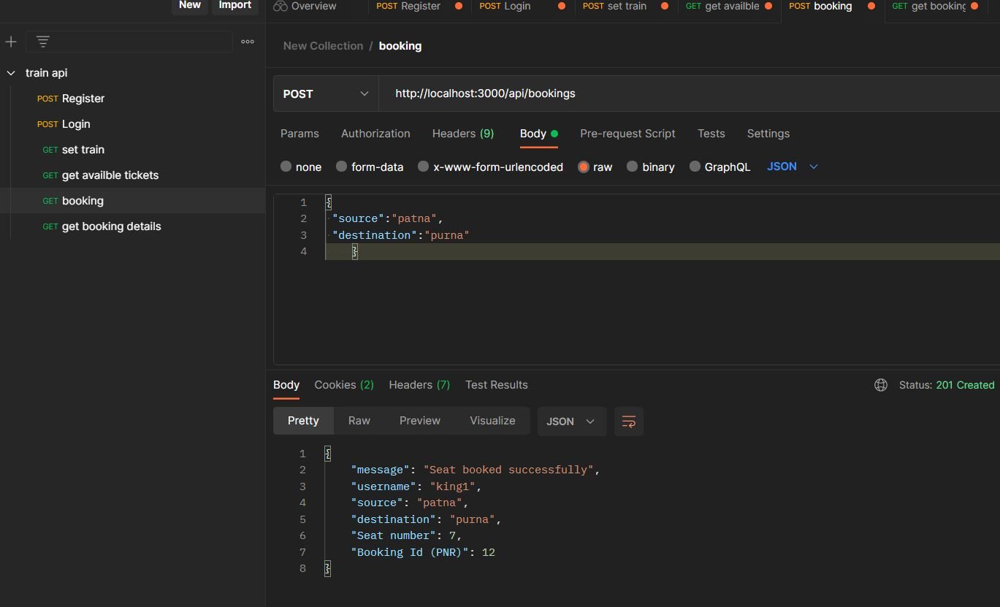

### Get booking details

User can use this Api to find details of  their booked seat, they need to enter booking Id which they got from booking .In return they will get a username, Booking Id, Seat number, source and destination

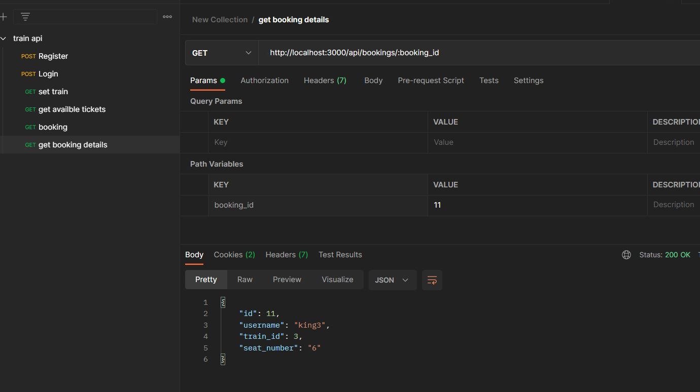

### Database Screenshots

Booking table

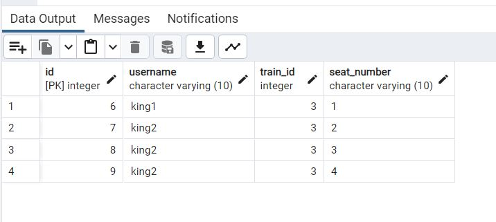

trains table

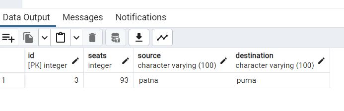

## Thank you

